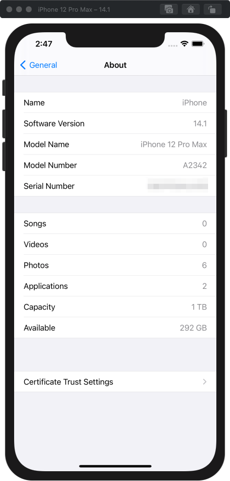
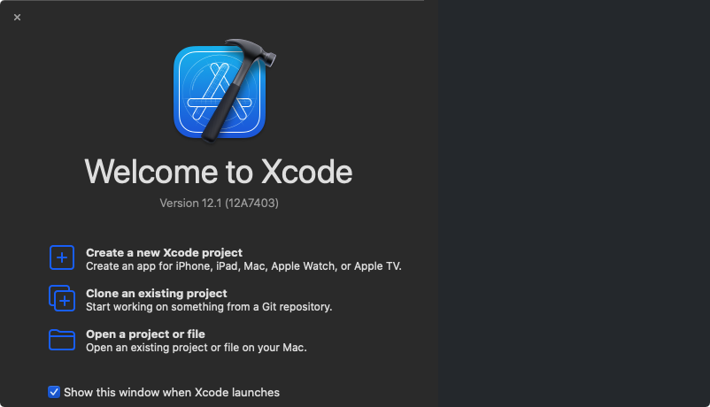
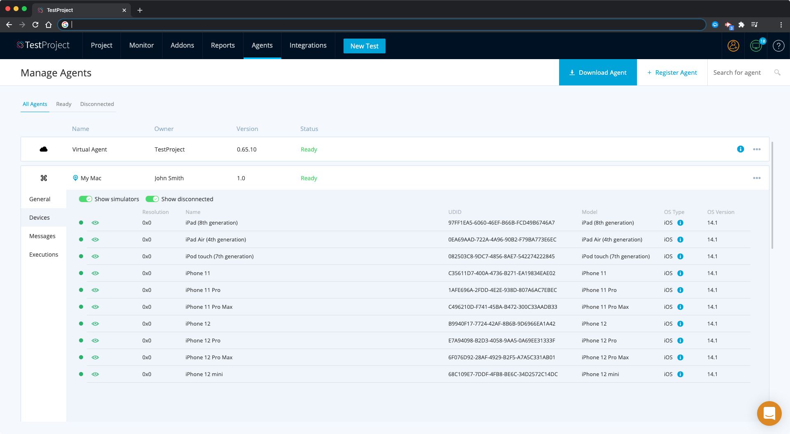
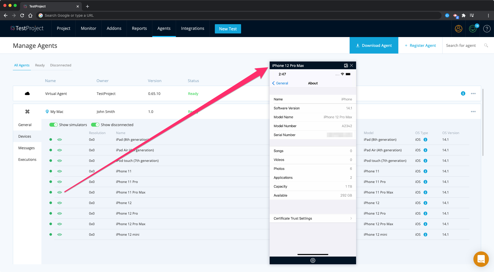
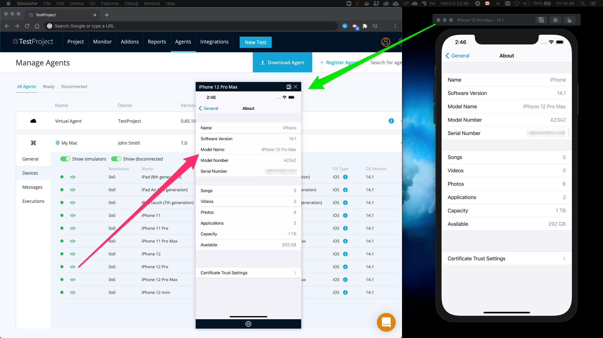

# iOS Simulators

## Getting Started

The simulator app, available within Xcode, presents the iPhone or iPad user interface in a window on your Mac computer. 

> It is not possible to run Xcode on a Windows or Linux operating systems.

You interact with Simulator by using the keyboard and the mouse to emulate taps, device rotation, and other user actions. It also allows you to automate your App without the need for a physical device.

## Prerequisites

* You need a Mac computer and macOS operating system.
* You need the TestProject Agent to be [installed ](../installation-and-setup.md)and running on your computer.
* You need Xcode to be installed from [Mac App Store.](https://apps.apple.com/us/app/xcode/id497799835?ls=1&mt=12) 

## Usage

With Xcode installed:

> It must be inside your /Applications folder.

TestProject Agent will detect all the simulators it comes with and display them in the connected simulators list in the TestProject application:

**Note: If the simulators are still not detected even if xCode is installed under Applications, open the terminal and run the below and restart your Agent:**

`sudo xcode-select -s $(ls -td /Applications/Xcode* | head -1)/Contents/Developer`

You can mirror any iOS simulator screen:

> There is no need to have an Apple Developer Account in order to do this \(on the contrary to iOS physical devices\).

Simulators are launched headless, but you can also start it from Xcode and see it's window mirrored in TestProject application.

