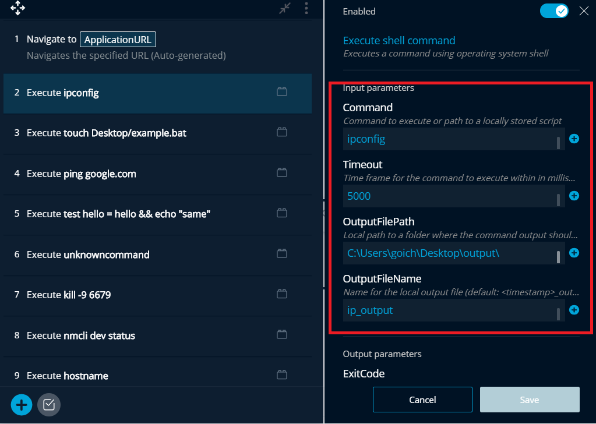
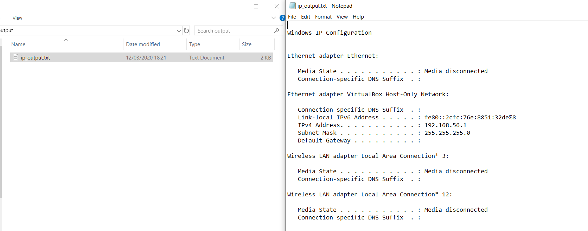
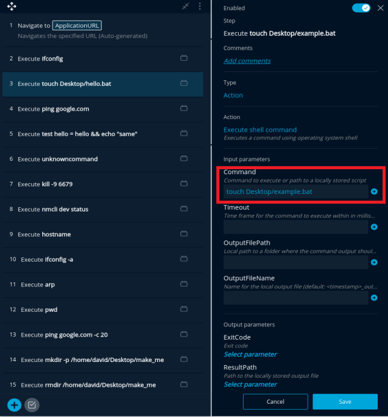

# Shell Commands Addon

The [Shell Commands Addon](https://addons.testproject.io/shell-commands) allows you to execute commands and scripts while running your tests. It supports all major operating systems: Windows \(CMD\), Linux \(sh\) and macOS. By utilizing “Command” parameter, you can execute any system command or a locally stored script.

If you ever need to send system shell commands or run scripts during your tests, this Addon will allow you to do so.

### **Actions**

This Addon contains a single action for sending those commands called: 'Execute'.

The **input** parameters are: 

* Command
* Expected result 
* Timeout
* Output file path
* Output file name

The **output** parameters are: 

* The exit code
* The output file path
* The shell output

\*\*Please note, that the step will be considered passed even if the command itself fails. You will be able to determine the success of the command by checking if your expected result is contained in the output of the shell command.

### **Examples**

#### **Windows:**

In this example we’ll run the “ipconfig” command. Since the command itself is endless, let's add a timeout. We’ll place the output of the command in a file in order to review it once we complete our test run:

Now, we are able to see the output of the command in our desired file:

#### **Linux:**

In this example, we will create a .bat file on our Linux desktop. We’ll create a new step using the Execute action and type the command “touch path/hello.bat”:

Once we complete the test run, we can see the file was created as expected on our desktop:

#### **macOS:**

In this example, we’ll create a new folder within a folder on our macOS desktop. We will use the Execute action with the command “mkdir path folder\_name.”:

Once we complete our test run, we'll be able to see the new folder at the desired location:

