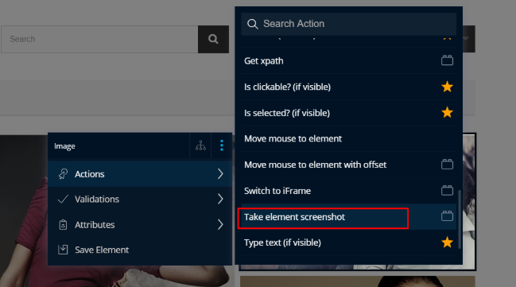

# Creating a Web Test using the TestProject Recorder

Creating a web test is a simple and straightforward process with the TestProject Recorder. You will want to make sure you have [setup a project](introduction-to-web-testing.md#getting-ready) and that you are in that project folder in the TestProject app.  This tutorial will walk you through a concrete example that uses the our [example webpage](https://example.testproject.io%20) so that you can see what it looks like to do this on an actual site. 

## Step 1 - Creating a Test

Creating a web test is as simple as clicking on the New Test button and then choosing the Web option as your test type

Once you have done that you can fill in a name and description for your test.  For this test we can just put in TestProject Example as the name.

The next thing you will be asked for is the application you are going to test. If this is the first test you are creating there will not be any applications in the list and so you will need to click on the Add a new application for testing button

This will prompt you for the URL of the application that you want to test and also ask you to give it a name for the system to use. For this example we will put in the URL of the TestProject example site.

After entering in the required information you can click Finish and you will be taken back to the test creation wizard which will automatically select the application you just created. You can then click Next and move on to the next step.

## Step 2 - Recording a Test

Now that you have named your test and the system knows what site to use for the testing, you are ready to start creating the steps that you want your test to execute.  You can create the steps manually if you want, or you can use the powerful recorder that TestProject offers. In order to use the recorder you will need to make sure that you have a local agent setup and running.  If you have not yet setup and started an agent you can follow the instructions in the [installation and setup](../../getting-started/installation-and-setup.md) section to do so. 

Once a local agent is running you will be able to click on the record button and then choose the Start Testing option

This will open a new instance of your browser and start recording. If a new instance does not open, you will want to check that your browser version is up to date.

## Step 3 - Add Test Steps

Now that the example web application is open in the test recorder you can start adding test steps to the test. The example will walk through adding steps to do a login workflow. The first thing will be to put in a user name. To do this, simply mouse over the Full Name field and click on it.  You will notice that when you click a step is automatically added to the test

You can then type in your full name and click away from the field to apply it.  You will once again notice that the recorder has automatically added a step to the test for you

You can then repeat this for the password field. First click on the field and then type in the password \(in this example site the password is 12345\) and TestProject will add the steps for you.  Once you have done that you can click on the login button and you will be taken to the next page on the form. 

## Step 4 - Adding Validation

Being able to create test steps that send commands to a web page is very powerful, but testers also need to be able to validate that a site is doing the correct thing. In this example you will validate that the second page of the form is using the name you entered on the first page. To do this you can mouse over the name on the page and then hit shift twice quickly \(Double Shift\) to freeze the element

Doing this will bring up a menu with a few options. Since you are trying to validate something, you will choose the Validations option. Just mouse over that to bring up the validation options. For this validation you can use the Contains Text? option by clicking on it.

This will open the create step panel where you can type in the text that you expect to see in this element \(in this case the name you entered on the login page\). You can then click on the Create button to add this test step to your test. 

And with that you have created your first web test!  You can close down the browser window and the test will be saved into you project, ready for you to run.

## Next Steps

If you want more details on how to select and use elements within the Recorder you can find information in the [finding and using elements](../finding-and-using-elements/) section of the documentation. The TestProject recorder can also be used to create [mobile tests](../mobile-testing/). If you want to see how to schedule and run the tests that you create you can find [information on that in the documentation as well](../../schedule-and-run-tests/create-and-schedule-jobs.md).

